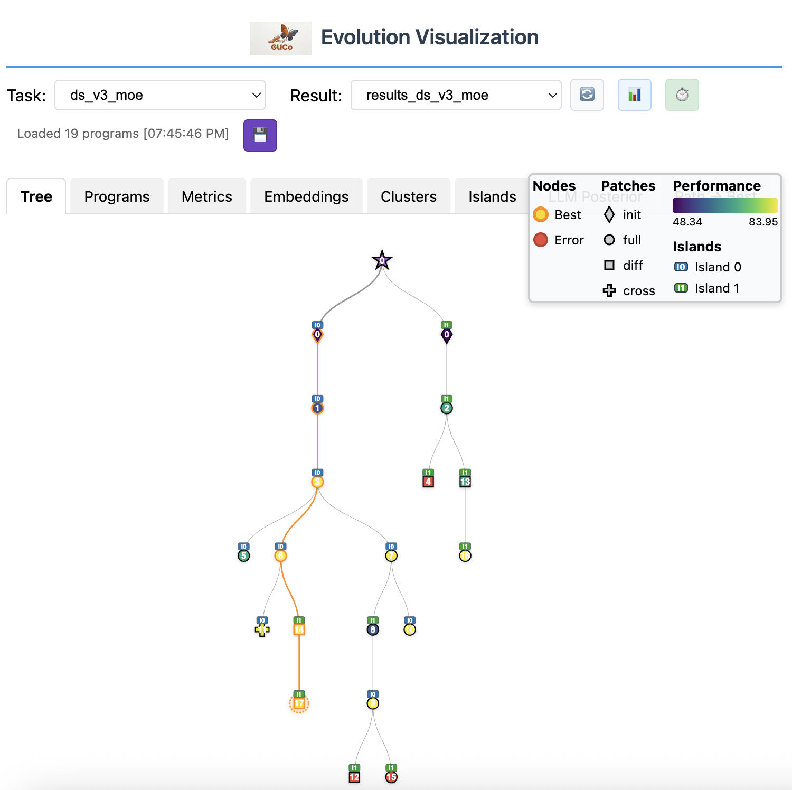

# Visualization and Analysis

CUCo provides an interactive web UI and programmatic plotting utilities for exploring evolution results.

## Web UI

<p align="center">
  
</p>

### Launching

```bash
# Open a specific database
cuco_visualize --db examples/ds_v3_moe/results_ds_v3_moe/evolution_db.sqlite --open

# Browse all databases under a directory
cuco_visualize /path/to/results --open

# Custom port
cuco_visualize --db results/evolution_db.sqlite -p 9000
```

<table>
  <tr>
    <th>Flag</th>
    <th>Default</th>
    <th>Description</th>
  </tr>
  <tr>
    <td><code>root_directory</code></td>
    <td><code>.</code></td>
    <td>Directory to scan for <code>.sqlite</code> databases</td>
  </tr>
  <tr>
    <td><code>--db</code></td>
    <td><code>None</code></td>
    <td>Path to a specific database file</td>
  </tr>
  <tr>
    <td><code>-p</code>, <code>--port</code></td>
    <td><code>8000</code></td>
    <td>HTTP server port</td>
  </tr>
  <tr>
    <td><code>--open</code></td>
    <td><code>off</code></td>
    <td>Open browser automatically</td>
  </tr>
</table>

### Features

The web UI is a single-page application served at `http://localhost:8000/`. It provides several views:

#### Tree View

Displays the evolution lineage as an interactive tree:
- Each node is a candidate program
- Edges connect parents to children
- Node color reflects fitness score (viridis colormap)
- Gold highlight marks the best program
- Red marks incorrect (failed verification) candidates
- Click any node to view its code, metrics, and diff from parent

#### Programs Table

A sortable table of all candidates:

<table>
  <tr>
    <th>Column</th>
    <th>Description</th>
  </tr>
  <tr>
    <td>Rank</td>
    <td>Fitness rank (1 = best)</td>
  </tr>
  <tr>
    <td>Generation</td>
    <td>When it was created</td>
  </tr>
  <tr>
    <td>Score</td>
    <td><code>combined_score</code></td>
  </tr>
  <tr>
    <td>Patch Type</td>
    <td><code>diff</code>, <code>full</code>, or <code>cross</code></td>
  </tr>
  <tr>
    <td>Island</td>
    <td>Island index</td>
  </tr>
  <tr>
    <td>Model</td>
    <td>LLM model used</td>
  </tr>
  <tr>
    <td>API Cost</td>
    <td>LLM query cost</td>
  </tr>
  <tr>
    <td>Correct</td>
    <td>Pass/fail</td>
  </tr>
</table>

Click any row to see the full program, its mutation diff, and evaluation feedback.

#### Metrics View

Plots of evolution progress:
- Best score over generations
- Individual candidate scores (scatter)
- Cumulative API cost

#### Embeddings View

Code similarity heatmap:
- Cosine similarity between all candidate embeddings
- Sortable by chronological order, cluster, or performance
- Helps identify population diversity and convergence

#### Clusters View

PCA-based visualization of candidate embeddings in 2D/3D space, colored by fitness or island.

#### Islands View

Per-island population breakdown and migration history.

#### Meta Scratchpad

Browse the meta-summarizer's output:
- Generation slider to view summaries over time
- Optimization recommendations
- Strategy patterns (what worked, what failed)
- Download as PDF

### API Endpoints

The web UI exposes JSON APIs for programmatic access:

<table>
  <tr>
    <th>Endpoint</th>
    <th>Method</th>
    <th>Description</th>
  </tr>
  <tr>
    <td><code>/list_databases</code></td>
    <td><code>GET</code></td>
    <td>List all <code>.sqlite</code> databases found under the root directory</td>
  </tr>
  <tr>
    <td><code>/get_programs?db_path=...</code></td>
    <td><code>GET</code></td>
    <td>Return all programs from a database as JSON</td>
  </tr>
  <tr>
    <td><code>/get_meta_files?db_path=...</code></td>
    <td><code>GET</code></td>
    <td>List <code>meta_N.txt</code> files</td>
  </tr>
  <tr>
    <td><code>/get_meta_content?db_path=...&filename=...</code></td>
    <td><code>GET</code></td>
    <td>Return content of a meta file</td>
  </tr>
</table>

## Plotting Utilities

CUCo includes matplotlib-based plotting functions for publication-quality figures.

### Lineage Tree

```python
from cuco.plots import plot_lineage_tree
from cuco.utils.load_df import load_evolution_df

df = load_evolution_df("results_ds_v3_moe/evolution_db.sqlite")
fig = plot_lineage_tree(df)
fig.savefig("lineage.pdf")
```

Produces a NetworkX graph with:
- Node shapes: circle (diff), square (full), triangle (init), plus (cross), star (best), X (incorrect)
- Viridis color scale by fitness
- Path to best node emphasized
- Colorbar for combined score

Requires GraphViz for optimal layout (`dot` engine). Falls back to manual hierarchical layout.

### Improvement Plot

```python
from cuco.plots import plot_improvement

fig = plot_improvement(df)
fig.savefig("improvement.pdf")
```

Shows:
- Cumulative best score over generations (line)
- Individual candidate scores (scatter)
- Path to best node (dashed line)
- Optional second y-axis for cumulative API cost

### Pareto Front

```python
from cuco.plots import plot_pareto

fig = plot_pareto(df, x_metric="time_ms", y_metric="complexity")
fig.savefig("pareto.pdf")
```

2D Pareto front visualization:
- Pareto-optimal candidates highlighted
- Dominated candidates dimmed
- Frontier line connecting Pareto points

### Embedding Similarity

```python
from cuco.plots import plot_embed_similarity

fig = plot_embed_similarity(embeddings, performances)
fig.savefig("similarity.pdf")
```

Two-panel figure:
- Cosine similarity heatmap (seaborn)
- Performance heatmap
- Optional hierarchical clustering for ordering

### Code Evolution Animation

```python
from cuco.plots.code_path_anim import create_evolution_video

create_evolution_video(
    results_dir="results_ds_v3_moe",
    output_path="evolution.mp4",
    resolution=(3840, 2160),
    fps=25,
)
```

Generates an MP4 video showing the code evolution along the path to the best candidate:
- Syntax highlighting (Pygments)
- Diff highlighting for changes
- Scrolling for long files
- History panes showing previous states

Requires MoviePy and PIL.

## Reading the Database Directly

The SQLite database can be queried directly for custom analysis:

```python
import sqlite3
import json

conn = sqlite3.connect("results_ds_v3_moe/evolution_db.sqlite")
cursor = conn.cursor()

# Get the best program
cursor.execute("""
    SELECT id, generation, combined_score, code
    FROM programs
    WHERE correct = 1
    ORDER BY combined_score DESC
    LIMIT 1
""")
best = cursor.fetchone()
print(f"Best: gen {best[1]}, score {best[2]:.2f}")

# Score distribution per generation
cursor.execute("""
    SELECT generation, AVG(combined_score), MAX(combined_score), COUNT(*)
    FROM programs
    WHERE correct = 1
    GROUP BY generation
    ORDER BY generation
""")
for gen, avg, mx, count in cursor.fetchall():
    print(f"Gen {gen}: avg={avg:.2f}, max={mx:.2f}, n={count}")

# Programs by island
cursor.execute("""
    SELECT island_idx, COUNT(*), AVG(combined_score)
    FROM programs
    WHERE correct = 1
    GROUP BY island_idx
""")
for island, count, avg in cursor.fetchall():
    print(f"Island {island}: {count} programs, avg score {avg:.2f}")

conn.close()
```

### Schema Reference

The `programs` table columns:

<table>
  <tr>
    <th>Column</th>
    <th>Type</th>
    <th>Description</th>
  </tr>
  <tr>
    <td><code>id</code></td>
    <td><code>TEXT</code></td>
    <td>Unique program ID</td>
  </tr>
  <tr>
    <td><code>code</code></td>
    <td><code>TEXT</code></td>
    <td>Full source code</td>
  </tr>
  <tr>
    <td><code>language</code></td>
    <td><code>TEXT</code></td>
    <td>Source language</td>
  </tr>
  <tr>
    <td><code>parent_id</code></td>
    <td><code>TEXT</code></td>
    <td>Parent program ID (NULL for seed)</td>
  </tr>
  <tr>
    <td><code>archive_inspiration_ids</code></td>
    <td><code>TEXT</code></td>
    <td>JSON list of archive inspiration IDs</td>
  </tr>
  <tr>
    <td><code>top_k_inspiration_ids</code></td>
    <td><code>TEXT</code></td>
    <td>JSON list of top-k inspiration IDs</td>
  </tr>
  <tr>
    <td><code>island_idx</code></td>
    <td><code>INTEGER</code></td>
    <td>Island assignment</td>
  </tr>
  <tr>
    <td><code>generation</code></td>
    <td><code>INTEGER</code></td>
    <td>Generation number</td>
  </tr>
  <tr>
    <td><code>timestamp</code></td>
    <td><code>TEXT</code></td>
    <td>Creation timestamp</td>
  </tr>
  <tr>
    <td><code>code_diff</code></td>
    <td><code>TEXT</code></td>
    <td>Mutation diff from parent</td>
  </tr>
  <tr>
    <td><code>combined_score</code></td>
    <td><code>REAL</code></td>
    <td>Fitness score</td>
  </tr>
  <tr>
    <td><code>public_metrics</code></td>
    <td><code>TEXT</code></td>
    <td>JSON timing/metrics</td>
  </tr>
  <tr>
    <td><code>private_metrics</code></td>
    <td><code>TEXT</code></td>
    <td>JSON internal metrics</td>
  </tr>
  <tr>
    <td><code>text_feedback</code></td>
    <td><code>TEXT</code></td>
    <td>LLM feedback string</td>
  </tr>
  <tr>
    <td><code>correct</code></td>
    <td><code>INTEGER</code></td>
    <td>0 or 1</td>
  </tr>
  <tr>
    <td><code>complexity</code></td>
    <td><code>TEXT</code></td>
    <td>JSON code complexity metrics</td>
  </tr>
  <tr>
    <td><code>embedding</code></td>
    <td><code>BLOB</code></td>
    <td>Code embedding vector</td>
  </tr>
  <tr>
    <td><code>in_archive</code></td>
    <td><code>INTEGER</code></td>
    <td>Whether in MAP-Elites archive</td>
  </tr>
  <tr>
    <td><code>metadata</code></td>
    <td><code>TEXT</code></td>
    <td>JSON metadata</td>
  </tr>
</table>

### Additional Tables

- `metadata_store` — key-value store for evolution state (e.g., `last_iteration`)
- `archive` — MAP-Elites archive tracking

## Results Directory Structure

```
results_my_workload/
├── evolution_db.sqlite          # SQLite database (all candidates)
├── experiment_config.yaml       # EvolutionConfig snapshot
├── meta_memory.json             # Meta-learning state
│
├── best/                        # Symlink to best generation
│   ├── my_kernel.cu             # Best evolved kernel
│   └── results/
│       ├── metrics.json
│       └── correct.json
│
├── gen_0/                       # Generation 0 (seed or first mutation)
│   ├── my_kernel.cu             # Evolved program (after patching)
│   ├── original.cu              # Parent code (before patching)
│   ├── main.cu                  # Copy used for evaluation
│   ├── edit.diff                # Diff: original → evolved
│   ├── rewrite.txt              # LLM raw output (for full rewrites)
│   └── results/
│       ├── metrics.json         # Score, timing, feedback
│       ├── correct.json         # Correctness verdict
│       ├── build.log            # nvcc compiler output
│       ├── run.log              # mpirun stdout/stderr
│       ├── job_log.out          # Job scheduler stdout
│       └── job_log.err          # Job scheduler stderr
│
├── gen_1/
│   └── ...
│
├── meta_8.txt                   # Meta-summary at generation 8
├── meta_12.txt                  # Meta-summary at generation 12
└── meta_16.txt                  # Meta-summary at generation 16
```
